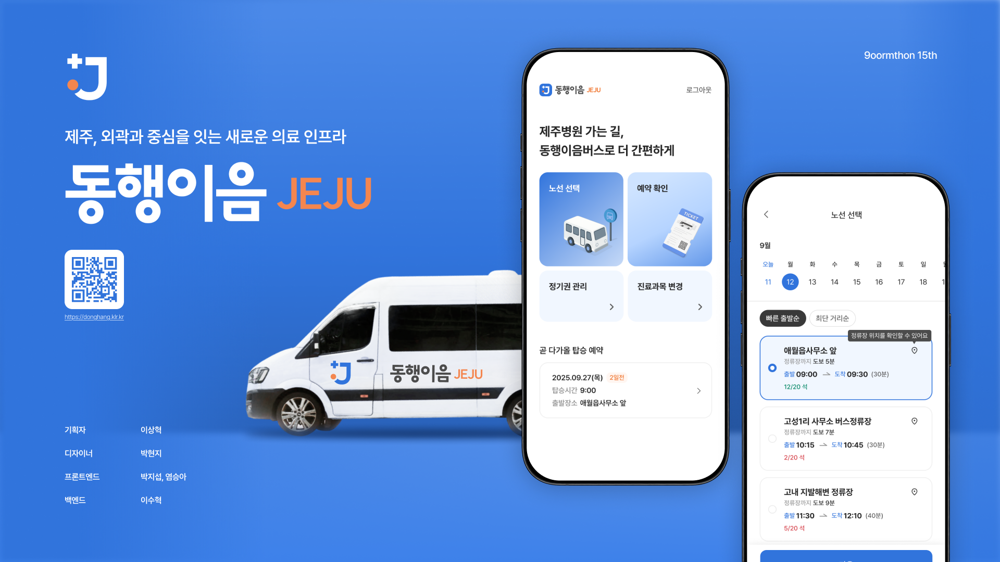
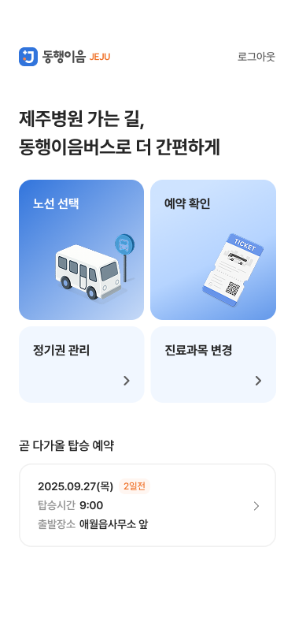

# 🚌 의료취약계층 전용 셔틀 플랫폼
> [동행이음] 제주 외곽·중산간 지역의 환자들이 **더 쉽고 빠르게 상급병원 진료를 받을 수 있도록** 돕는 의료 접근성 개선 서비스

**주기적으로 병원에 재방문해야하는 만성 질환 환자들**  
하지만 제주 외곽지역의 환자들은 교통 인프라의 어려움을 겪고 있다는 사실, 알고 계신가요?  

저희 서비스는 이러한 문제점에서 시작해, '제주의 외곽과 중심을 잇는 새로운 의료 인프라'를 구축했습니다.

 

## 📅 프로젝트 개요

* **진행 기간**: 2025.09.24 ~ 2025.09.26 (구름톤 in JEJU 15기)
* **팀 구성**: 총 5명

  * Frontend: 2명(박지섭, 염승아)
  * Backend: 1명(이수혁)
  * 기획: 1명(이상혁)
  * 디자인: 1명(박현지)

 

## ✨ 주요 기능

1. **진료과목 선택**

   * 환자가 원하는 진료과를 먼저 선택 → 예약 효율성 및 병원 사전 대응 강화

2. **셔틀 예약**

   * 고정 노선 기반 좌석 예약
   * 남은 좌석 수, 출발·도착 시간, 소요시간 등을 한눈에 확인

3. **예약 확인 및 관리**

   * 예약 내역 필터링 (빠른 출발순, 최단 거리순)
   * 예약 결과 페이지에서 실시간 상태 확인 가능

 

## 🛠 기술 스택

### Frontend

* React + Vite
* TypeScript
* TailwindCSS
* Zustand (상태 관리)
* Framer Motion (애니메이션)
* Vapor UI (디자인 시스템)
* Lefthook

### Backend & 인프라

* SpringBoot
* MySQL
* Kubernetes (EKS)
* ArgoCD
* Jenkins

 

## 🎥 시연 영상
[시연 영상 보기](./docs/demo.mp4)

 

## 🎨 화면 구성

| 메인 홈                     | 진료과목 선택                  | 노선 예약                      | 예약 결과                        |
| ------------------------ | ------------------------ | -------------------------- | ---------------------------- |
|  |  |  |  |

 

## 💡 프로젝트 회고

* **짧은 기간**(3일) 동안 **의료 인프라 문제를 해결할 수 있는 최소 기능 제품(MVP)**을 구현
* 디자인 시스템(Vapor UI)과 애니메이션(Framer Motion)을 적용해 **일관성과 사용자 경험**을 확보
* 향후 과제:
* 
  * 실시간 셔틀 위치 확인
  * 의료기관과의 직접 연동 API

---

✍️ 프로젝트에 관한 더 자세한 설명은 [구름톤 전시관(추후 링크 업데이트 예정)]에서 확인할 수 있습니다.

